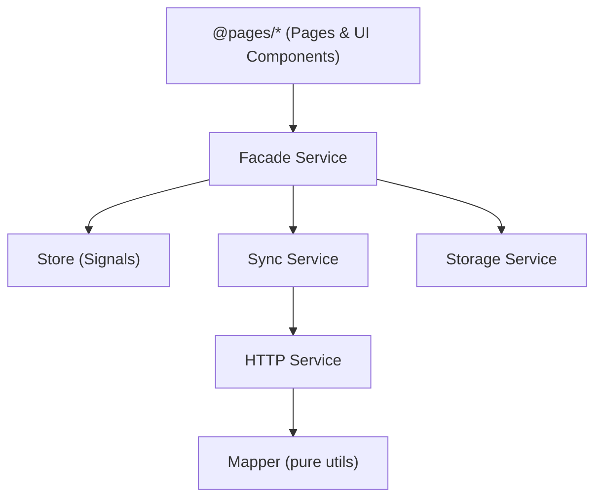

## Activation Contract

Load this skill when:
- Architecting Angular + Ionic mobile applications
- Organizing project structure with Scope Rule principles
- Setting up Ionic routing (tabs, menu, modal navigation)
- Applying Screaming Architecture to mobile apps
- Deciding component/service placement
- Building or refactoring a feature under `features/<feature-name>/`
- Creating feature services: facade, http, storage, sync
- Creating pure mappers in `features/<feature>/utils/`
- Wiring signal stores to pages via a Facade

## Hard Rules

1. **Scope Rule (absolute)**: Code used by 2+ pages or features → `shared/ui/`. Same feature across some pages → `features/<feature>/components/`. 1 tab/page only → local. NO EXCEPTIONS.
2. **Screaming Architecture**: Tab/page names describe business functionality, not technical implementation. Main tab/page components MUST have the same name as their folder.
3. **Routing blocks**: Keep them explicit in `pages/`: `start-app/`, `in-app/`, `out-app/`.
4. **Feature Facade**: Pages and UI components inject ONLY `*-facade.service.ts` — never `*-http`, `*-storage`, or `*-sync` directly.
5. **Flow Direction**: Facade → Store + Sync + Storage. Sync → HTTP. HTTP → Mapper (pure functions, statically used).
6. **Mapper purity**: `utils/*.mapper.ts` files are pure TypeScript functions. NEVER use `@Injectable()` in a mapper.
7. **Modern Injection**: ALL feature services MUST use `inject()`, never constructor parameter injection.
8. **Store isolation**: Signal store is injected ONLY by the Facade. Pages inject `*Facade`, never `*Store`.
9. **Store API**: Private `_state` signal holds full state; public API is always `computed()` — never expose writable signals. Update via `.update()` or dedicated setters spreading previous state. One store per feature domain.
10. **Path aliases**: Configure `@pages/*`, `@shared/*`, `@core/*`, `@features/*` in `tsconfig.json`.
11. **Lazy loading**: All routes use `loadComponent()` or `loadChildren()`.
12. **File naming**: NO `.component`, `.service`, `.module` suffixes.

## Decision Gates

| Situation | Action |
| --- | --- |
| Component used in 1 tab/page | Local placement in that tab/page folder |
| Component reused inside a single feature across related pages | `features/<feature>/components/` |
| Component used by 2+ pages/features | `shared/ui/` |
| App-wide singleton (auth, guards) | `core/auth/` |
| Capacitor plugin abstraction | `core/device/` |
| Utility service (no business domain) | `shared/utils/` |
| Building a feature under `features/<feature>/` | Apply Feature-Driven Slicing: `models/`, `store/`, `services/`, `utils/`, `components/` |
| Page needs feature data | Inject ONLY the `*Facade` — never `*Store`, `*Http`, `*Storage`, `*Sync` |
| Transforming DTOs to domain models | Pure functions in `utils/*.mapper.ts` — NO `@Injectable()` |
| Choosing navigation pattern | Tabs OR menu — never mix both at the same route level |

## Execution Steps

### 1. Apply Scope Rule

Count how many tabs/pages use the component, then place it according to the Decision Gates table above. Document WHY the placement was chosen.

### 2. Set Up Project Structure

Follow the canonical tree below. See [`references/project-structure.md`](references/project-structure.md) for the full annotated version.

```
src/app/
├── core/              # Infrastructure (Singletons & Global)
│   ├── auth/          # Session logic, tokens, global guards
│   ├── http/          # Interceptors and base API client
│   ├── storage/       # Capacitor wrappers (Preferences/SQLite)
│   ├── device/        # Capacitor plugin abstractions
│   └── error-handler/ # Sentry, Crashlytics and Logs
├── shared/            # Cross-cutting UI + utilities (2+ features)
│   ├── ui/            # Dumb components used in 2+ features/pages
│   ├── pipes/
│   ├── directives/
│   ├── utils/         # Utility services (no business domain)
│   └── constants/
├── features/          # THE HEART: Business Logic by Domain (Feature-Driven Slicing)
│   ├── user/
│   └── payments/
├── pages/             # Orchestrators (Smart Components & Routing)
│   ├── start-app/     # Onboarding & Authentication
│   ├── in-app/        # Logged-in experience (tabs, menu, features)
│   └── out-app/       # Utility/public pages
├── app.component.ts   # Plugin initialization (Push, DeepLinks, StatusBar)
├── app.config.ts      # Global providers
└── app.routes.ts      # Root routing (Lazy loading blocks)
```

### 3. Slice a Feature (Feature-Driven Slicing)

Each domain under `features/<feature-name>/` MUST split responsibilities:

| Folder | Purpose |
|--------|---------|
| `models/` | Domain interfaces, models, Use Cases |
| `store/` | Signal store (coordinated by Facade) |
| `services/` | `*-facade`, `*-http`, `*-storage`, `*-sync` (create only the ones the feature needs) |
| `utils/` | Pure mappers (`*.mapper.ts`, NO `@Injectable()`) and pure functions reused only within the feature |
| `components/` | Smart components reused by feature + related pages |

Naming conventions for `services/`:
- `[feature-name]-facade.service.ts`: Single contact point for `@pages/*`. Exposes consolidated state via Angular Signals (`asReadonly()`). Centralizes calls to sub-services.
- `[feature-name]-sync.service.ts`: Periodic sync flows, offline operations, background task queues (if applicable).
- `[feature-name]-storage.service.ts`: Local cache persistence (save, remove, load) using typed unique keys (if applicable).
- `[feature-name]-http.service.ts`: REST/GraphQL calls mapped from system URI constants (if applicable).

Dependency flow:



Full code example: [`references/facade-pattern-example.md`](references/facade-pattern-example.md).

### 4. Set Up Feature State (Signal Store)

Each feature domain that requires state uses a signal store in `features/<domain>/store/`. The store is **coordinated exclusively by the Facade** — pages MUST NOT inject the store directly.

Rules:
- Private `_state` signal holds the full state object
- Public API is always `computed()` — never expose the writable signal
- State is always updated via `.update()` or dedicated setter methods spreading the previous state
- One store per feature domain — do not share stores across unrelated features
- Store is injected ONLY by the Facade — pages inject `*Facade`, never `*Store`

Code example: [`references/facade-pattern-example.md`](references/facade-pattern-example.md) "User Domain Example".

### 5. Set Up Routing

Tabs, menu, and modal navigation patterns: [`references/routing-patterns.md`](references/routing-patterns.md).

Path aliases (always in `tsconfig.json`):

```json
{
  "compilerOptions": {
    "paths": {
      "@pages/*": ["src/app/pages/*"],
      "@shared/*": ["src/app/shared/*"],
      "@core/*": ["src/app/core/*"],
      "@features/*": ["src/app/features/*"]
    }
  }
}
```

## Placement Examples

| Component/Service Type | Used In | Placement | Reason |
|------------------------|---------|-----------|--------|
| `ProductCard` | Home tab only | `pages/in-app/tabs/home/components/` | Scope Rule: 1 tab |
| `HeaderBack` | Home, Profile, Settings | `shared/ui/headers/` | Scope Rule: 3+ tabs |
| `AuthService` | Entire app | `core/auth/` | Singleton, global auth concern |
| `NetworkService` | Entire app | `core/device/` | Capacitor plugin abstraction |
| `PushNotificationService` | Entire app | `core/device/` | Capacitor plugin abstraction |
| `UiService` | Entire app | `shared/utils/` | Utility service, no business domain |
| `RouterService` | Entire app | `shared/utils/` | Utility service, no business domain |
| `DateFormatPipe` | 2+ tabs | `shared/pipes/` | Scope Rule: 2+ tabs |
| `PaymentForm` | Payments feature + payment page | `features/payments/components/` | Feature-specific smart component |
| `PaymentsFacade` | Pages consuming payments | `features/payments/services/` | Single contact point for pages |
| `PaymentsHttpService` | Payments feature (internal) | `features/payments/services/` | REST/GraphQL calls — injected by Facade/Sync only |
| `PaymentsStorageService` | Payments feature (internal) | `features/payments/services/` | Local cache persistence — injected by Facade only |
| `PaymentsSyncService` | Payments feature (internal) | `features/payments/services/` | Offline sync queue — injected by Facade only |
| `payments.mapper.ts` | Payments feature (internal) | `features/payments/utils/` | Pure DTO→domain mapping, no `@Injectable()` |
| `PaymentModel` | Payments feature | `features/payments/models/` | Domain model/interface |
| `user.store.ts` | User feature (internal) | `features/user/store/` | Feature signal store — coordinated by Facade |

## Quality Checklist

Before finalizing any architectural decision:

- [ ] **Scope verification**: Correctly counted tab/page usage?
- [ ] **Navigation pattern**: Using tabs, menu, or modal navigation appropriately (no mixing)?
- [ ] **Naming validation**: Do names match tabs/pages and follow conventions?
- [ ] **Lazy loading**: All routes using `loadComponent()` or `loadChildren()`?
- [ ] **Type safety**: No `any` types?
- [ ] **File naming**: No `.component`, `.service`, `.module` suffixes?
- [ ] **Facade isolation**: Pages/components only inject the Facade (never `*-http`, `*-storage`, `*-sync`)?
- [ ] **Mapper purity**: `utils/*.mapper.ts` files are pure functions with no `@Injectable()`?
- [ ] **Store isolation**: Pages inject `*Facade`, never `*Store`?

## Anti-Patterns

### Don't: Put Business Logic in Pages

```typescript
// ❌ WRONG - API calls and domain logic inside a page
// pages/in-app/features/payment/payment.page.ts
export class PaymentPage {
  async pay() {
    const result = await this.http.post('/api/payments', data);
  }
}

// ✅ CORRECT - Page delegates to the feature Facade
// features/payments/services/payments-facade.service.ts  ← business logic lives here
export class PaymentPage {
  private readonly paymentsFacade = inject(PaymentsFacade);
  async pay() {
    await this.paymentsFacade.processPayment(data);
  }
}
```

### Don't: UI Injecting Infrastructure Services

```typescript
// ❌ WRONG - Page injects HTTP/Storage/Sync directly
export class PaymentPage {
  private readonly httpService = inject(PaymentsHttpService);
  private readonly storageService = inject(PaymentsStorageService);
}

// ✅ CORRECT - Page injects ONLY the Facade
export class PaymentPage {
  private readonly paymentsFacade = inject(PaymentsFacade);
}
```

### Don't: Make Mappers `@Injectable()`

```typescript
// ❌ WRONG - Mapper as an injectable service
@Injectable({ providedIn: 'root' })
export class PaymentsMapper {
  mapDtoToModel(dto: PaymentDto): PaymentModel { ... }
}

// ✅ CORRECT - Pure function in utils/
// features/payments/utils/payments.mapper.ts
export function mapPaymentDtoToModel(dto: PaymentDto): PaymentModel { ... }
```

### Don't: Confuse `features/` (domain) with `pages/in-app/features/` (routing)

```typescript
// src/app/features/          ← Domain layer: models, store, services, utils, components
// src/app/pages/in-app/features/  ← Routing layer: pages NOT in tabs or menu

// ❌ WRONG - Page-only components in the domain features folder
src/app/features/payments/components/payment-page-header.ts

// ✅ CORRECT - Page-only components stay local to their page
src/app/pages/in-app/features/payment/components/payment-page-header.ts

// ✅ CORRECT - Feature-sliced services live under services/
src/app/features/payments/services/payments-facade.service.ts
```

### Don't: Put Capacitor Plugin Wrappers Outside `core/device/`

```typescript
// ❌ WRONG - Capacitor logic scattered in pages
const net = Network.getStatus(); // Direct plugin call in page

// ✅ CORRECT - Abstract Capacitor plugins in core/device/
// core/device/network.service.ts
```

### Don't: Violate Scope Rule

```typescript
// ❌ WRONG - Component used in 3 tabs but placed locally
pages/in-app/tabs/home/components/shared-card.ts

// ✅ CORRECT
shared/ui/cards/shared-card.ts
```

### Don't: Mix Navigation Patterns

```typescript
// ❌ WRONG - Mixing tabs and menu at the same route level
{ path: 'tabs', children: [...] }
{ path: 'menu', children: [...] }

// ✅ CORRECT - Choose one primary navigation pattern
{ path: 'tabs', children: [...] }
```

## Output Contract

After applying this skill, the agent MUST return:
- The Scope Rule decision for every component/service analyzed (usage count + chosen placement + reason).
- The exact folder structure created or modified under `features/<feature>/` (with the `models/`, `store/`, `services/`, `utils/`, `components/` split).
- The list of feature services created (`*Facade`, `*Http`, `*Storage`, `*Sync`) and which were skipped as not applicable.
- The routing files created/modified and the navigation pattern chosen (tabs vs menu vs modal).
- Confirmation that path aliases are configured in `tsconfig.json`.
- Any pending manual steps the user must perform.

## References

- [Full project structure guide](references/project-structure.md)
- [Facade pattern example (full code)](references/facade-pattern-example.md)
- [Routing patterns (tabs, menu, modal)](references/routing-patterns.md)
- [UI interaction patterns](references/ui-interaction-pattern.md)
- [Capacitor platform detection](references/capacitor-platform-detection.md)
- [Ionic Angular Documentation](https://ionicframework.com/docs/angular/overview)
- [Ionic Routing Guide](https://ionicframework.com/docs/angular/navigation)
- [Angular Routing](https://angular.dev/guide/routing)
