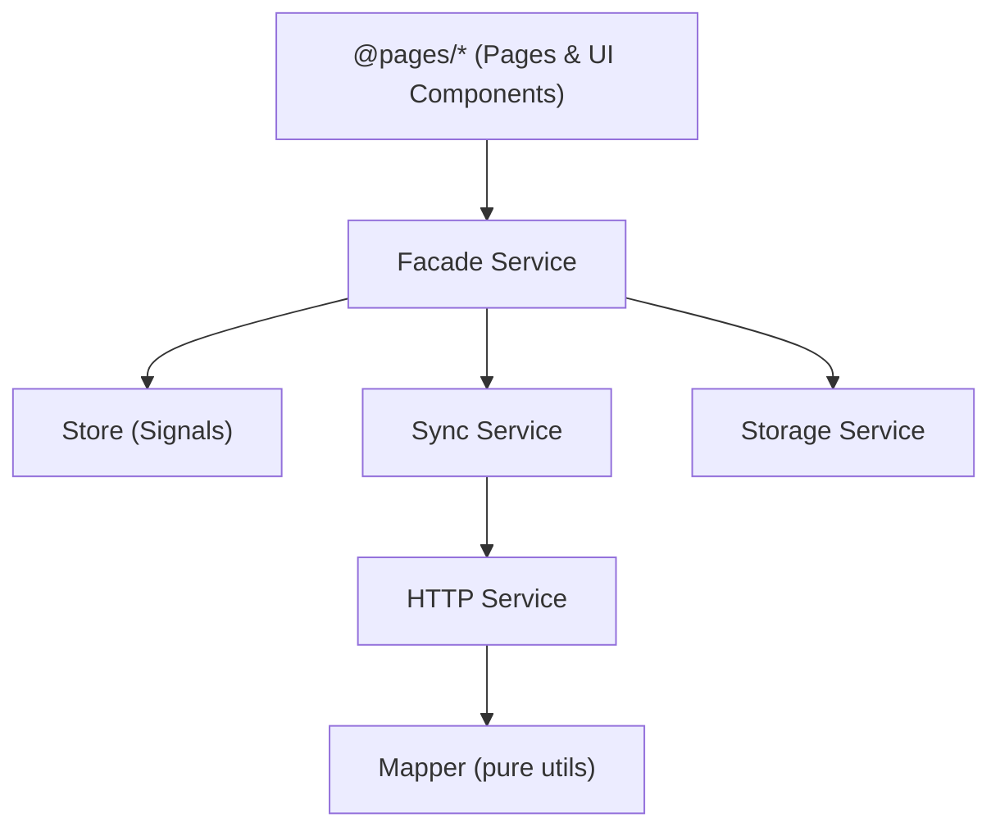

## When to Use

Load this skill when:
- Architecting Angular + Ionic mobile applications
- Organizing project structure with Scope Rule principles
- Setting up Ionic routing (tabs, menu, modal navigation)
- Applying Screaming Architecture to mobile apps
- Deciding component/service placement

## The Scope Rule - Your Unbreakable Law

**"Scope determines structure"**

- Code used by 2+ pages or features → MUST go in `shared/ui/`
- Component used by the same feature across some pages → MUST go in `features/<feature>/components/`
- Code used by 1 tab/page only → MUST stay local in that tab/page folder
- **NO EXCEPTIONS** - This rule is absolute and non-negotiable

## Screaming Architecture for Angular + Ionic

Your structures must IMMEDIATELY communicate what the application does:

- Tab/page names must describe business functionality, not technical implementation
- Directory structure must separate concerns clearly: `core/` (infrastructure), `features/` (business logic), `pages/` (routing/orchestration), `shared/` (cross-cutting UI/utilities)
- Keep routing blocks explicit in `pages/`: `start-app/`, `in-app/`, `out-app/`
- Main tab/page components MUST have the same name as their folder

---

## Ionic + Angular Project Structure

```
src/
├── app/
│   ├── core/                          # Infrastructure (Singletons & Global)
│   │   ├── auth/                      # Session logic, tokens and global guards
│   │   │   ├── guards/
│   │   │   │   ├── auth.guard.ts      # Global auth guard
│   │   │   │   └── public.guard.ts    # Global unauth guard
│   │   │   └── auth.service.ts
│   │   ├── http/                      # Interceptors and base API client
│   │   │   ├── app-http.interceptor.ts
│   │   │   └── crashlytics-error-handler.interceptor.ts
│   │   ├── storage/                   # Capacitor wrappers (Preferences/SQLite)
│   │   │   └── storage.service.ts
│   │   ├── device/                    # Capacitor plugin abstractions
│   │   │   ├── network.service.ts
│   │   │   └── push-notification.service.ts
│   │   └── error-handler/             # Sentry, Crashlytics and Logs
│   │
│   ├── shared/                        # UI Dumb Components (Presentational) & Utilities
│   │   ├── ui/                        # ONLY for components used in 2+ features/pages
│   │   │   ├── headers/
│   │   │   │   ├── header-back.ts
│   │   │   │   └── header-main.ts
│   │   │   ├── modals/
│   │   │   │   └── confirmation-modal.ts
│   │   │   └── cards/
│   │   │       └── info-card.ts
│   │   ├── pipes/
│   │   │   └── date-format.pipe.ts
│   │   ├── directives/
│   │   │   └── auto-focus.directive.ts
│   │   ├── utils/                     # Shared utility services (no business domain)
│   │   │   ├── ui.service.ts          # Centralized Ionic UI controllers (alert, toast, loading)
│   │   │   └── router.service.ts      # Router utilities
│   │   └── constants/
│   │       ├── database.constants.ts
│   │       └── api.constants.ts
│   │
│   ├── features/                      # THE HEART: Business Logic by Domain (Feature-Driven Slicing)
│   │   ├── user/
│   │   │   ├── models/                # Interfaces, models, and Use Cases
│   │   │   ├── store/                 # user.store.ts (Signals) — coordinated by Facade
│   │   │   ├── services/              # Feature-sliced services (Facade pattern)
│   │   │   │   ├── user-facade.service.ts   # Single contact point for @pages/* (exposes asReadonly())
│   │   │   │   ├── user-http.service.ts     # REST/GraphQL calls (if applicable)
│   │   │   │   ├── user-storage.service.ts  # Local cache persistence (if applicable)
│   │   │   │   └── user-sync.service.ts     # Periodic sync/offline queue (if applicable)
│   │   │   ├── utils/                 # Pure functions reused only within the feature
│   │   │   │   └── user.mapper.ts     # DTOs → domain models (NO @Injectable)
│   │   │   └── components/            # Smart components (feature + related pages)
│   │   └── payments/
│   │       ├── models/                # payment.model.ts
│   │       ├── store/                 # payments.store.ts
│   │       ├── services/
│   │       │   ├── payments-facade.service.ts
│   │       │   ├── payments-http.service.ts
│   │       │   ├── payments-storage.service.ts
│   │       │   └── payments-sync.service.ts
│   │       ├── utils/
│   │       │   └── payments.mapper.ts
│   │       └── components/
│   │           └── payment-form.component.ts
│   │
│   ├── pages/                         # Orchestrators (Smart Components & Routing)
│   │   ├── start-app/                 # Block: Onboarding & Authentication
│   │   │   ├── login/
│   │   │   │   ├── login.page.ts
│   │   │   │   ├── login.page.html
│   │   │   │   └── login.page.scss
│   │   │   ├── register/
│   │   │   │   └── register.page.ts
│   │   │   └── start-app.routes.ts
│   │   │
│   │   ├── in-app/                    # Block: Logged-in experience
│   │   │   ├── tabs/                  # Main tab-based navigation (tabs only usage)
│   │   │   │   ├── home/
│   │   │   │   │   ├── home.page.ts
│   │   │   │   │   └── components/    # Tab-specific components
│   │   │   │   │       └── home-card.component.ts    # Used ONLY by home page
│   │   │   │   ├── profile/
│   │   │   │   │   └── profile.page.ts
│   │   │   │   ├── tabs.routes.ts
│   │   │   │   ├── tabs.page.ts
│   │   │   │   ├── tabs.page.html
│   │   │   │   └── tabs.page.scss
│   │   │   │
│   │   │   ├── menu/                  # Side menu navigation (menu only usage)
│   │   │   │   ├── dashboard/
│   │   │   │   │   └── dashboard.page.ts
│   │   │   │   ├── settings/
│   │   │   │   │   └── settings.page.ts
│   │   │   │   └── menu.routes.ts
│   │   │   │
│   │   │   ├── features/              # Pages not included in menu or tabs
│   │   │   │   ├── payment/
│   │   │   │   │   └── payment.page.ts    # Uses components from features/payments/components
│   │   │   │   ├── withdraw/
│   │   │   │   │   └── withdraw.page.ts
│   │   │   │   └── features.routes.ts
│   │   │   └── in-app.routes.ts
│   │   │
│   │   └── out-app/                   # Block: Utility/public pages
│   │       ├── not-found/
│   │       │   └── not-found.page.ts
│   │       ├── maintenance/
│   │       │   └── maintenance.page.ts
│   │       └── out-app.routes.ts
│   │
│   ├── app.component.ts               # Plugin initialization (Push, DeepLinks, StatusBar)
│   ├── app.config.ts                  # Global providers (Routes, HttpClient)
│   └── app.routes.ts                  # Root routing (Lazy loading blocks)
│
└── main.ts                        # Bootstrap
```

### Path Aliases Configuration

Always configure these aliases in `tsconfig.json`:

```json
{
  "compilerOptions": {
    "paths": {
      "@pages/*": ["src/app/pages/*"],
      "@shared/*": ["src/app/shared/*"],
      "@core/*": ["src/app/core/*"],
      "@features/*": ["src/app/features/*"]
    }
  }
}
```

---

## Feature-Driven Slicing & State Management Facade

When building or refactoring any complex domain inside `src/app/features/[feature-name]/`, you MUST split technical responsibilities into the following ecosystem of injectable services and pure utilities.

### Naming Convention & Feature Files

- `services/[feature-name]-facade.service.ts`: Single contact point for pages (`@pages/*`). Exposes consolidated state via Angular Signals (`asReadonly()`). Centralizes calls to sub-services.
- `services/[feature-name]-sync.service.ts`: Encapsulates periodic sync flows, offline operations, and background task queues (if applicable).
- `services/[feature-name]-storage.service.ts`: Manages local cache persistence (save, remove, load) using typed unique keys (if applicable).
- `services/[feature-name]-http.service.ts`: Strictly hosts REST/GraphQL calls mapped from system URI constants (if applicable).
- `utils/[feature-name].mapper.ts`: Pure TypeScript functions to transform network responses (DTOs) into valid domain models. **NEVER use `@Injectable()` in this file.**

Create only the services the feature actually needs (`http`, `storage`, `sync` are optional).

### Critical Dependency Inversion Rules

1. **UI Isolation:** Pages and components are FORBIDDEN from injecting infrastructure services (`http`, `storage`, `sync`). Communication is exclusively through the Facade.
2. **Flow Direction:** Facade coordinates Store, Sync, and Storage. Sync consumes HTTP. HTTP uses Mapper functions statically.
3. **Modern Injection:** ALL services MUST use Angular's `inject()` function — never constructor parameter injection.

### Dependency Flow



### Code Example

```typescript
// features/payments/utils/payments.mapper.ts — pure functions, NO @Injectable()
import { PaymentDto } from '../models/payment.dto';
import { PaymentModel } from '../models/payment.model';

export function mapPaymentDtoToModel(dto: PaymentDto): PaymentModel {
  return {
    id: dto.id,
    amount: dto.amount,
    status: dto.status,
  };
}
```

```typescript
// features/payments/services/payments-http.service.ts
import { Injectable, inject } from '@angular/core';
import { HttpClient } from '@angular/common/http';
import { firstValueFrom } from 'rxjs';
import { PAYMENTS_API } from '@shared/constants/api.constants';
import { mapPaymentDtoToModel } from '../utils/payments.mapper';
import { PaymentModel } from '../models/payment.model';

@Injectable({ providedIn: 'root' })
export class PaymentsHttpService {
  private readonly http = inject(HttpClient);

  async fetchPayments(): Promise<PaymentModel[]> {
    const dtos = await firstValueFrom(this.http.get(PAYMENTS_API.LIST));
    return dtos.map(mapPaymentDtoToModel);
  }
}
```

```typescript
// features/payments/store/payments.store.ts
import { Injectable, signal, computed } from '@angular/core';
import { PaymentModel } from '../models/payment.model';

@Injectable({ providedIn: 'root' })
export class PaymentsStore {
  private readonly _items = signal<PaymentModel[]>([]);
  private readonly _loading = signal(false);

  readonly items = computed(() => this._items());
  readonly loading = computed(() => this._loading());

  setItems(items: PaymentModel[]): void {
    this._items.set(items);
  }

  setLoading(loading: boolean): void {
    this._loading.set(loading);
  }
}
```

```typescript
// features/payments/services/payments-facade.service.ts
import { Injectable, inject } from '@angular/core';
import { PaymentsStore } from '../store/payments.store';
import { PaymentsHttpService } from './payments-http.service';
import { PaymentsStorageService } from './payments-storage.service';

@Injectable({ providedIn: 'root' })
export class PaymentsFacade {
  private readonly store = inject(PaymentsStore);
  private readonly http = inject(PaymentsHttpService);
  private readonly storage = inject(PaymentsStorageService);

  // Expose consolidated state as readonly signals
  readonly items = this.store.items;
  readonly loading = this.store.loading;

  async loadPayments(): Promise<void> {
    this.store.setLoading(true);
    try {
      const cached = await this.storage.load();
      if (cached.length) {
        this.store.setItems(cached);
      }
      const items = await this.http.fetchPayments();
      this.store.setItems(items);
      await this.storage.save(items);
    } finally {
      this.store.setLoading(false);
    }
  }
}
```

```typescript
// pages/in-app/features/payment/payment.page.ts — ONLY injects the Facade
import { Component, inject } from '@angular/core';
import { PaymentsFacade } from '@features/payments/services/payments-facade.service';

@Component({
  selector: 'app-payment',
  template: `
    @if (facade.loading()) {
      <ion-spinner />
    } @else {
      @for (item of facade.items(); track item.id) {
        <payment-form [payment]="item" />
      }
    }
  `,
})
export class PaymentPage {
  readonly facade = inject(PaymentsFacade);

  constructor() {
    this.facade.loadPayments();
  }
}
```

---

## Feature State Pattern (Signal Store)

Each feature domain that requires state management uses a signal-based store placed in `features/<domain>/store/`. The store is **coordinated exclusively by the Facade** — pages and components MUST NOT inject the store directly.

```typescript
// features/user/store/user.store.ts
import { Injectable, signal, computed } from '@angular/core';
import { UserModel } from '../models/user.model';

@Injectable({
  providedIn: 'root',
})
export class UserStore {
  // Private signals for internal state
  private readonly _state = signal<UserState>({
    items: [],
    loading: false,
    error: null,
  });

  // Public readonly computed values (exposed to Facade only)
  readonly items = computed(() => this._state().items);
  readonly loading = computed(() => this._state().loading);
  readonly error = computed(() => this._state().error);

  setItems(items: UserModel[]): void {
    this._state.update((state) => ({ ...state, items }));
  }

  setLoading(loading: boolean): void {
    this._state.update((state) => ({ ...state, loading }));
  }
}
```

The Facade re-exposes store state to pages via readonly signals:

```typescript
// features/user/services/user-facade.service.ts
import { Injectable, inject } from '@angular/core';
import { UserStore } from '../store/user.store';
import { UserHttpService } from './user-http.service';

@Injectable({ providedIn: 'root' })
export class UserFacade {
  private readonly store = inject(UserStore);
  private readonly http = inject(UserHttpService);

  // Re-expose store state — pages read these, never the store directly
  readonly items = this.store.items;
  readonly loading = this.store.loading;
  readonly error = this.store.error;

  async loadItems(): Promise<void> {
    this.store.setLoading(true);
    try {
      const items = await this.http.fetchUsers();
      this.store.setItems(items);
    } finally {
      this.store.setLoading(false);
    }
  }
}
```

**Rules:**
- Private `_state` signal holds the full state object
- Public API is always `computed()` — never expose the writable signal
- State is always updated via `.update()` or dedicated setter methods spreading the previous state
- One store per feature domain — do not share stores across unrelated features
- Store is injected ONLY by the Facade — pages inject `UserFacade`, never `UserStore`

---

## Ionic Routing Patterns

### Tab-Based Navigation

```typescript
// app.routes.ts
import { Routes } from '@angular/router';

export const routes: Routes = [
  {
    path: '',
    redirectTo: 'login',
    pathMatch: 'full',
  },
  {
    path: '',
    loadChildren: () => import('./pages/start-app/start-app.routes').then(m => m.START_APP_ROUTES),
  },
  {
    path: '',
    loadChildren: () => import('./pages/in-app/in-app.routes').then(m => m.IN_APP_ROUTES),
  },
  {
    path: '',
    loadChildren: () => import('./pages/out-app/out-app.routes').then(m => m.OUT_APP_ROUTES),
  },
  {
    path: '**',
    redirectTo: 'not-found',
  },
];
```

### In-App Routing Pattern

```typescript
// pages/in-app/in-app.routes.ts
import { Routes } from '@angular/router';

export const IN_APP_ROUTES: Routes = [
  {
    path: '',
    redirectTo: 'tabs',
    pathMatch: 'full',
  },
  {
    path: 'tabs',
    loadChildren: () => import('./tabs/tabs.routes').then(m => m.tabsRoutes),
  },
  {
    path: 'menu',
    loadChildren: () => import('./menu/menu.routes').then(m => m.menuRoutes),
  },
];
```

### Tab-Based Navigation

```typescript
// pages/in-app/tabs/tabs.routes.ts
import { Routes } from '@angular/router';
import { TabsPage } from './tabs.page';

export const tabsRoutes: Routes = [
  {
    path: '',
    component: TabsPage,
    children: [
      {
        path: 'home',
        loadComponent: () => import('./home/home.page').then(m => m.HomePage),
      },
      {
        path: 'profile',
        loadComponent: () => import('./profile/profile.page').then(m => m.ProfilePage),
      },
      {
        path: '',
        redirectTo: 'home',
        pathMatch: 'full',
      },
    ],
  },
];
```

**tabs.page.ts:**

```typescript
import { Component } from '@angular/core';
import { IonicModule } from '@ionic/angular';
import { TABS } from '@shared/constants/settings';

@Component({
  selector: 'app-tabs',
  imports: [IonicModule],
  templateUrl: './tabs.page.html',
})
export class TabsPage {
  readonly tabsItems = TABS;
}
```

**tabs.page.html:**

```html
<ion-tabs>
  <ion-tab-bar slot="bottom">
    @for (item of tabsItems; track $index) {
      <ion-tab-button [tab]="item.tab">
        <ion-icon aria-hidden="true" [name]="item.icon"></ion-icon>
        <ion-label>{{ item.title }}</ion-label>
      </ion-tab-button>
    }
  </ion-tab-bar>
</ion-tabs>
```

**TABS constant in `src/app/shared/constants/settings.ts`:**

```typescript
export interface ITabItem {
  tab: string;
  title: string;
  icon: string;
}

export const TABS: ITabItem[] = [
  {
    tab: 'home',
    title: 'Home',
    icon: 'home-outline',
  },
  {
    tab: 'library',
    title: 'Library',
    icon: 'library-outline',
  },
  {
    tab: 'my-space',
    title: 'Space',
    icon: 'planet-outline',
  },
  {
    tab: 'social',
    title: 'Social',
    icon: 'people-outline',
  },
];
```

### Modal Navigation

```typescript
import { Component, inject } from '@angular/core';
import { ModalController } from '@ionic/angular';
import { MyModalComponent } from '@shared/ui/modals/my-modal';

@Component({
  selector: 'app-page',
  imports: [IonicModule],
  template: `<ion-button (click)="openModal()">Open Modal</ion-button>`,
})
export class MyPage {
  private readonly modalCtrl = inject(ModalController);

  async openModal(): Promise<void> {
    const modal = await this.modalCtrl.create({
      component: MyModalComponent,
    });
    await modal.present();
    const { data, role } = await modal.onWillDismiss();
  }
}
```

---

## Decision Framework

When analyzing component/service placement, you MUST:

1. **Count usage**: Identify exactly how many tabs/pages use the component
2. **Apply the Scope Rule**: 
   - 1 tab/page = local placement in that tab/page folder
   - Component used by 2+ pages/features = `shared/ui/`
   - Component reused inside a single feature across related pages = `features/<feature>/components/`
   - App-wide singleton (auth, guards) = `core/auth/`
   - Capacitor plugin abstraction = `core/device/`
   - Utility service (no business domain) = `shared/utils/`
3. **Document decision**: Explain WHY the placement was chosen

### Placement Examples

| Component/Service Type | Used In | Placement | Reason |
|------------------------|---------|-----------|--------|
| `ProductCard` | Home tab only | `pages/in-app/tabs/home/components/` | Scope Rule: 1 tab |
| `HeaderBack` | Home, Profile, Settings | `shared/ui/headers/` | Scope Rule: 3+ tabs |
| `AuthService` | Entire app | `core/auth/` | Singleton, global auth concern |
| `NetworkService` | Entire app | `core/device/` | Capacitor plugin abstraction |
| `PushNotificationService` | Entire app | `core/device/` | Capacitor plugin abstraction |
| `UiService` | Entire app | `shared/utils/` | Utility service, no business domain |
| `RouterService` | Entire app | `shared/utils/` | Utility service, no business domain |
| `DateFormatPipe` | 2+ tabs | `shared/pipes/` | Scope Rule: 2+ tabs |
| `PaymentForm` | Payments feature + payment page | `features/payments/components/` | Feature-specific smart component |
| `PaymentsFacade` | Pages consuming payments | `features/payments/services/` | Single contact point for pages |
| `PaymentsHttpService` | Payments feature (internal) | `features/payments/services/` | REST/GraphQL calls — injected by Facade/Sync only |
| `PaymentsStorageService` | Payments feature (internal) | `features/payments/services/` | Local cache persistence — injected by Facade only |
| `PaymentsSyncService` | Payments feature (internal) | `features/payments/services/` | Offline sync queue — injected by Facade only |
| `payments.mapper.ts` | Payments feature (internal) | `features/payments/utils/` | Pure DTO→domain mapping, no `@Injectable()` |
| `PaymentModel` | Payments feature | `features/payments/models/` | Domain model/interface |
| `user.store.ts` | User feature (internal) | `features/user/store/` | Feature signal store — coordinated by Facade |

---

## Quality Checklist

Before finalizing any architectural decision:

1. ✅ **Scope verification**: Correctly counted tab/page usage?
2. ✅ **Navigation pattern**: Using tabs, menu, or modal navigation appropriately?
3. ✅ **Naming validation**: Do names match tabs/pages and follow conventions?
4. ✅ **Lazy loading**: All routes using `loadComponent()` or `loadChildren()`?
5. ✅ **Type safety**: No `any` types?
6. ✅ **File naming**: No `.component`, `.service`, `.module` suffixes?
7. ✅ **Facade isolation**: Pages/components only inject the Facade (never `*-http`, `*-storage`, `*-sync`)?
8. ✅ **Mapper purity**: `utils/*.mapper.ts` files are pure functions with no `@Injectable()`?

---

## Anti-Patterns

### Don't: Put Business Logic in Pages

```typescript
// ❌ WRONG - API calls and domain logic inside a page
// pages/in-app/features/payment/payment.page.ts
export class PaymentPage {
  async pay() {
    const result = await this.http.post('/api/payments', data); // Direct API call from page
    // mapping, validation, error handling... all here
  }
}

// ✅ CORRECT - Page delegates to the feature Facade
// features/payments/services/payments-facade.service.ts  ← business logic lives here
// pages/in-app/features/payment/payment.page.ts
export class PaymentPage {
  private readonly paymentsFacade = inject(PaymentsFacade);
  async pay() {
    await this.paymentsFacade.processPayment(data); // Page only orchestrates
  }
}
```

### Don't: UI Injecting Infrastructure Services

```typescript
// ❌ WRONG - Page injects HTTP/Storage/Sync directly
// pages/in-app/features/payment/payment.page.ts
export class PaymentPage {
  private readonly httpService = inject(PaymentsHttpService);
  private readonly storageService = inject(PaymentsStorageService);

  async loadPayments() {
    const items = await this.httpService.fetchPayments();
    await this.storageService.save(items);
  }
}

// ✅ CORRECT - Page injects ONLY the Facade
export class PaymentPage {
  private readonly paymentsFacade = inject(PaymentsFacade);

  async loadPayments() {
    await this.paymentsFacade.loadPayments();
  }
}
```

### Don't: Make Mappers `@Injectable()`

```typescript
// ❌ WRONG - Mapper as an injectable service
@Injectable({ providedIn: 'root' })
export class PaymentsMapper {
  mapDtoToModel(dto: PaymentDto): PaymentModel {
    return { id: dto.id, amount: dto.amount };
  }
}

// ✅ CORRECT - Pure function in utils/
// features/payments/utils/payments.mapper.ts
export function mapPaymentDtoToModel(dto: PaymentDto): PaymentModel {
  return { id: dto.id, amount: dto.amount };
}
```

### Don't: Confuse `features/` (domain) with `pages/in-app/features/` (routing)

```typescript
// src/app/features/          ← Domain layer: models, store, services, utils, components
// src/app/pages/in-app/features/  ← Routing layer: pages NOT in tabs or menu

// ❌ WRONG - Putting page-only components in the domain features folder
src/app/features/payments/components/payment-page-header.ts  // Only used by payment.page

// ✅ CORRECT - Page-only components stay local to their page
src/app/pages/in-app/features/payment/components/payment-page-header.ts

// ✅ CORRECT - Smart components reused by feature AND pages go in the feature folder
src/app/features/payments/components/payment-form.component.ts

// ✅ CORRECT - Feature-sliced services live under services/
src/app/features/payments/services/payments-facade.service.ts
src/app/features/payments/services/payments-http.service.ts
src/app/features/payments/utils/payments.mapper.ts
```

### Don't: Put Capacitor Plugin Wrappers Outside `core/device/`

```typescript
// ❌ WRONG - Capacitor logic scattered in pages or shared services
// pages/in-app/tabs/home/home.page.ts
const net = Network.getStatus(); // Direct plugin call in page

// ✅ CORRECT - Abstract Capacitor plugins in core/device/
// core/device/network.service.ts  ← single abstraction point
// If you change the plugin, you only touch one file
```

### Don't: Violate Scope Rule

```typescript
// ❌ WRONG - Component used in 3 tabs but placed locally
pages/in-app/tabs/home/components/shared-card.ts  // Used in home, profile, settings

// ✅ CORRECT
shared/ui/cards/shared-card.ts
```

### Don't: Mix Navigation Patterns

```typescript
// ❌ WRONG - Don't mix tabs and menu in same route level
{
  path: 'tabs',
  children: [...],
}
{
  path: 'menu',
  children: [...],
}

// ✅ CORRECT - Choose one primary navigation pattern
{
  path: 'tabs',
  children: [...], // All main navigation here
}
```

---

## Resources

- [Ionic Angular Documentation](https://ionicframework.com/docs/angular/overview)
- [Ionic Routing Guide](https://ionicframework.com/docs/angular/navigation)
- [Angular Routing](https://angular.dev/guide/routing)

---

**Remember**: You are the guardian of clean, scalable Angular + Ionic architecture. Every decision must follow the Scope Rule and result in code that immediately communicates what the app does (Screaming Architecture).
